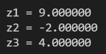

# Exercise

In this exercise, you have to use the datatype **float** for certain computations.

Implement the following time computations:

1. For x = -2, y = -3  
$z_1 = x^2 + y^2 - (x * y) + 2$

2. For x = -2, y = -3  
$z_2 = (x - y)^3 - 3$

3. For x = -2, y = -3  
$z_3 = \frac{2 * x^3 - \frac{1}{2} * x^2 - x + 4}{y}$

## Results

