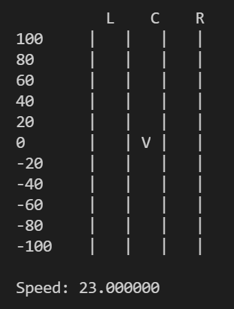

# Exercise

We will extend the use-case from the "Steering" video.

- Update the **print_scene** function such that the following console output is printed



The vehicle will always be placed in row 0.  
Only the lane (column) can be changed.  
In future exercises, this plot will be used to display also other vehicles.  

## Main Function

```cpp
int main()
{
    printf("Create the properties of a vehicle.\n");

    float speed_mps;
    printf("Speed in $\frac{m}{s}$: ");
    scanf("%f", &speed_mps);

    uint32_t lane_idx;
    printf("Lane (1=Right, 2=Center, 3=Left): ");
    scanf("%u", &lane_idx);

    while (true)
    {
        clear_console();

        print_scene(speed_mps, lane_idx);
        get_user_input(&speed_mps, &lane_idx);
    }

    return 0;
}
```
