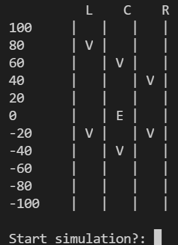

# Exercise

Update the existing code:

- Remove the user input of the ego vehicle values
- Add const to every parameter and variable where it is appropriate
- print_scene
  - This function now takes
  ```cpp
  const VehicleType *ego_vehicle, const NeighborVehiclesType *vehicles
  ```
  - Inside the for-loop print out all vehicles at their correct position (distance and lane)



## Main Function

```cpp
int main()
{
    VehicleType ego_vehicle;
    NeighborVehiclesType vehicles;

    init_ego_vehicle(&ego_vehicle);
    init_vehicles(&vehicles);

    print_vehicle(&ego_vehicle);
    print_neighbor_vehicles(&vehicles);

    print_scene(&ego_vehicle, &vehicles);

    printf("Start simulation?: ");
    char Input;
    (void)scanf("%c", &Input);

    while (true)
    {
        clear_console();

        print_scene(&ego_vehicle, &vehicles);

        sleep_console(500);
    }

    return 0;
}
```
